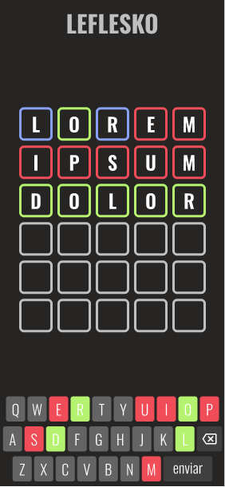

<p align="center">
  
</p>

<p align="center">
  

  

  
</p>

## ℹ️ Sobre o projeto

Leflesko é baseado no Wordle, um jogo que tem como objetivo adivinhar uma palavra de cinco letras em até seis tentativas.

## 🧪 Tecnologias

Este projeto foi desenvolvido utilizando as seguintes tecnologias:

- [NextJS](https://nextjs.org/)
- [Styled Components](https://styled-components.com/)
- [TypeScript](https://www.typescriptlang.org/pt/)

## 🚀 Executando localmente

Clone o projeto e acesse a pasta.

```bash
git clone https://github.com/viiniciusgs/leflesko

cd leflesko
```

Execute este comando para instalar as dependências e rode o projeto.

```bash
yarn install

yarn dev
```

## 🔖 Layout

Você pode visualizar o projeto através dos links abaixo:

- [Vercel](https://leflesko.vercel.app/)

- [Figma](https://www.figma.com/file/3YUR1QGzMmowMahmDmAfrc/Leflesko?node-id=2%3A2)

## 🕹️ Como jogar

O objetivo do jogo é adivinhar uma palavra de cinco letras em até seis tentativas, depois de cada tentativa o jogador receberá um feedback, conforme mostrado abaixo:

</br>


A letra **"S"** faz parte da palavra e está na posição correta

</br>


A letra **"I"** faz parte da palavra mas não está na posição correta

</br>


A letra **"D"** não faz parte da palavra

</br>

## 📝 License

Este projeto está licenciado sob a Licença MIT. Veja o [LICENSE](LICENSE) arquivo para detalhes.

---

Feito com 💙 por [Vinicius Gabriel](https://www.linkedin.com/in/viiniciusgs/) ✌️
